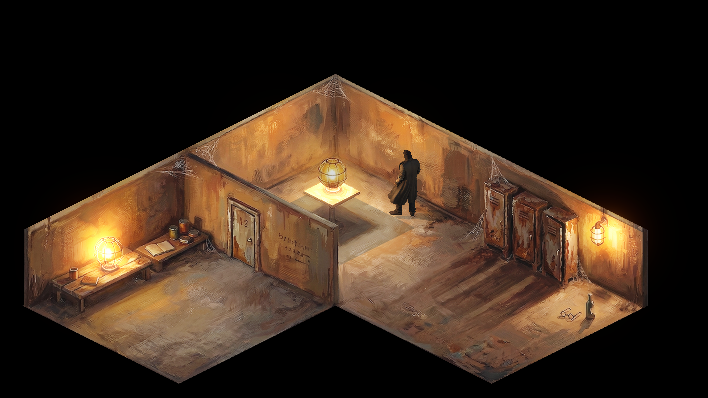

# Disco Elysium Style Render Pipeline

This Unity project implements a custom render pipeline designed to achieve graphics similar to those in the game *Disco Elysium*.

## Inspiration

This project was inspired by Murky-Goose-1291's tutorial on creating Disco Elysium-like graphics in Unity. You can find the original post here: [Reddit Tutorial](https://www.reddit.com/r/Unity3D/comments/1saren6/tutorial_how_to_create_graphics_like_in_disco/)

## Getting Started

1. Open the project in Unity (version recommended: 6+).
2. Ensure the Universal Render Pipeline (URP) is set up.
3. Explore the Assets folder for scenes, shaders, and materials.

## Features

- Custom shaders for stylized rendering
- Post-processing effects
- Scene setup for testing

For more details, refer to the original tutorial.